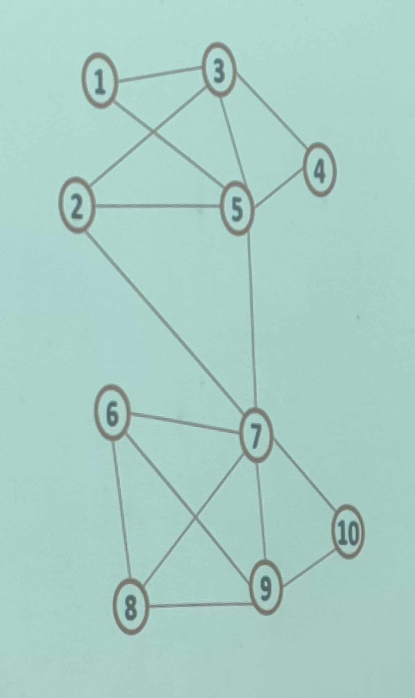
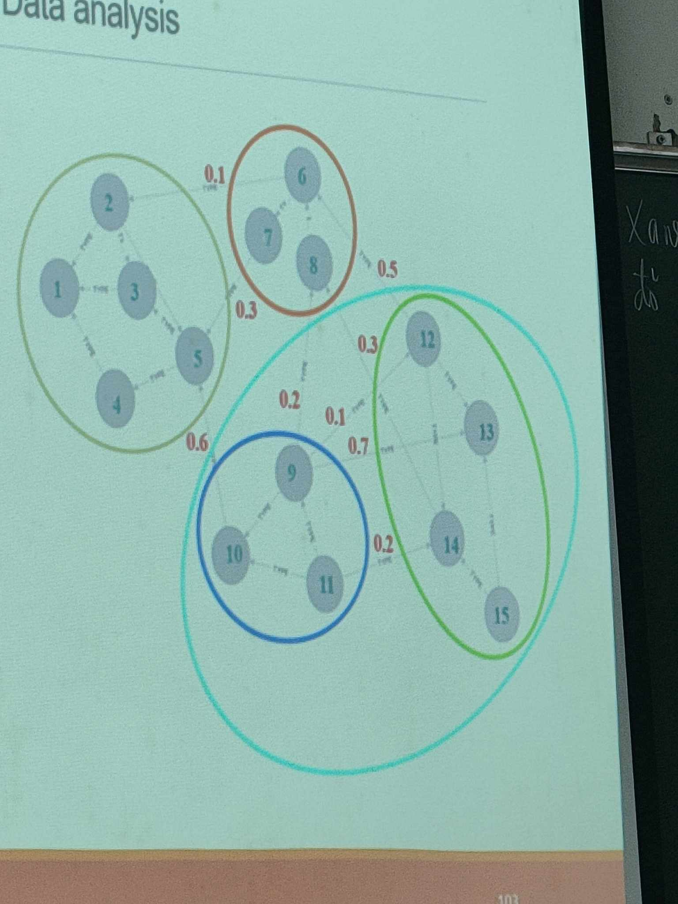
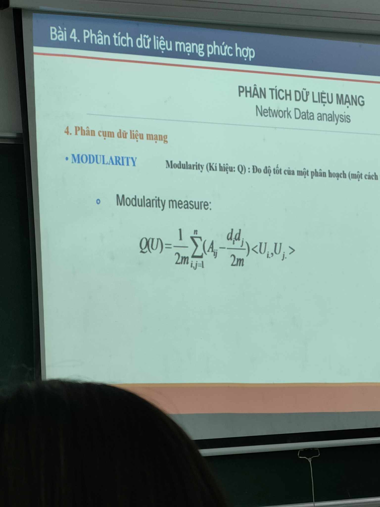

<!-- markdownlint-disable MD050 -->
# Complex network data analysis

## Tổng quan phân tích dữ liệu mạng

### DL mạng

- Bài toán phân cụm DL
- Phân hoạch
  - Dạng vector
  - Dạng ma trận
- DL mạng (DL đồ thị, mạng lưới, network, graph,...)
  - Nút, đỉnh, node, vertex
  - Cạnh, edge
  - Đồ thị có hướng, vô hướng
  - Đồ thị có/không có trọng số

## Dữ liệu mạng là gì

## Bài toán phân cụm dữ liệu mạng

## Các kỹ thuật phân cụm dữ liệu mạng

## Dữ liệu đồ thị

- K/n đồ thị
- Biểu diễn đồ thị trong máy tính
  - Dạng ma trận kề (vô hướng, không trọng số)
    - VD:
      - [1 2 3 4 5]
      - [2 3 5]
      - [3 4]

        | A     | 1 | 2 | 3 | 4 | 5 |   | d |
        |-------|---|---|---|---|---|---|---|
        | **1** | 0 | 1 | 1 | 1 | 1 |   | 4 |
        | **2** | 1 | 0 | 1 | 0 | 1 |   | 3 |
        | **3** | 1 | 1 | 0 | 1 | 0 |   | 4 |
        | **4** | 1 | 0 | 1 | 0 | 1 |   | 3 |
        | **5** | 1 | 1 | 0 | 1 | 0 |   | 3 |

  - Dạng pairs (or edges)
    - VD:
      - [1 2 3]
      - [2 3 6]
      - [3 6]
      - [4 5]
      - [5 6]
      - If have weight -> add more column

        | 1 | 2 |
        |---|---|
        | 1 | 3 |
        | 2 | 3 |
        | 2 | 6 |
        | 3 | 6 |
        | 4 | 5 |
        | 5 | 6 |

  - Dạng net
    - *Vertices N
    - *Arcs

- VD:

  - Dạng ma trận kề

    | 0 | 0 | 1 | 0 | 1 | 0 | 0 | 0 | 0 | 0 |
    |---|---|---|---|---|---|---|---|---|---|
    | 0 | 0 | 1 | 0 | 1 | 0 | 1 | 0 | 0 | 0 |
    | 1 | 1 | 0 | 1 | 1 | 0 | 0 | 0 | 0 | 0 |
    | 0 | 0 | 1 | 0 | 1 | 0 | 0 | 0 | 0 | 0 |
    | 1 | 1 | 1 | 1 | 0 | 0 | 1 | 0 | 0 | 0 |
    | 0 | 0 | 0 | 0 | 0 | 0 | 1 | 1 | 1 | 0 |
    | 0 | 1 | 0 | 0 | 1 | 1 | 0 | 1 | 1 | 1 |
    | 0 | 0 | 0 | 0 | 0 | 1 | 1 | 0 | 1 | 0 |
    | 0 | 0 | 0 | 0 | 0 | 1 | 1 | 1 | 0 | 1 |
    | 0 | 0 | 0 | 0 | 0 | 0 | 1 | 0 | 1 | 0 |

  - Dạng pairs

  | 1 | 3  |
  |---|----|
  | 1 | 5  |
  | 2 | 3  |
  | 2 | 5  |
  | 2 | 7  |
  | 3 | 4  |
  | 3 | 5  |
  | 4 | 5  |
  | 5 | 7  |
  | 6 | 7  |
  | 6 | 8  |
  | 6 | 9  |
  | 7 | 8  |
  | 7 | 9  |
  | 7 | 10 |
  | 8 | 9  |
  | 9 | 10 |

## Phân tích cộng đồng mạng

- Cộng đồng mạng: là một tập các nodes mà:
  - Số lượng các cạnh trong nội bộ cụm là lớn (mật độ dày)
  - Số lượng các cạnh liên cụm là nhỏ
- Phân cụm DL đồ thị: chia các nút mạng thành các cộng đông
  - Cụm ~ Cộng đồng
- Phân cụm DL mạng: Graph Clustering, Community Detection, Community Analysis
  - Tìm một phân hoạch phân chia TỐT NHẤT các đỉnh của đồ thị thành các cụm
  - TỐT NHẤT: Maximum/Minimum mật độ đo
    - Gọi U là một phân hoạch bất kỳ trong tập D là tập tất cả các phân hoạch
    - Gọi f(U) là một độ đo trên phân hoạch U
    - __Mục tiêu: Tìm một phân hoạch U* sao cho f(U*) đạt Max/Min__
  - Có rất nhiều độ đo f đc định nghĩa
    - Graph cut:
      - Phân chia tập đỉnh đồ thị thành 2 tập V = V1 + V2
      - Cut set: Tập các cạnh với 2 đầu ở 2 tập đỉnh khác nhau
      - Cut size: Số lượng cạnh trong 1 cut-set
      - k-CUT (k>1): là một cách phân chia tập đỉnh V của đồ thị thành k tập rời nhau, không rỗng
      - K-CUT weight: tổng tất cả các trọng số của các cạnh mà có hai đầu ở 2 tập khác nhau
      - VD: 
        - a, Cấp 1: Cut-set = {(5,10), (8,9), (8,14), (6,12)}; Cut-size = 4
        - b, k = 4 -> k-cut weight = (0.6 + 0.2 + 0.3 + 0.5) + (0.1 + 0.7 + 0.2) + (0.1 + 0.3) = 3.0
      - Mimimum k-CUT:
        - Gọi U = {V1, V2, ..., Vk} là 1 phân hoạch đồ thị G(V, E) thành k cụm, Tìm phân hoạch U* sao cho k-CUT(U) đạt Min
    - Edge Betweeness
      - B1: Chia đồ thị thành 2 cụm, tính edge betweeness cho tất cả các cạnh
        - EB: tổng số đường đi ngắn nhất nối 2 đỉnh bất kỳ và có đi qua 2 đỉnh đó
      - B2: Cắt tại cạnh có EB lớn nhất
        - Tính lại EB cho tất cả các cạnh của các cụm
    - Modularity (Q): Đo độ tốt của một phân hoạch
      - CT: 
        - m: cạnh
        - n: đỉnh
        - d: bậc đỉnh
        - Aij: ma trận kề
        - <Ui, Uj>: tích vô hướng hàng thứ i, j của cụm U
      - Q nhận giá trị từ [-1, 1], càng gần 1 càng tốt
- Clauset, Newman and More 2006 (CNM):
  - Giải thuật CNM:
    - Gọi AQ là giá trị thay đổi của Q khi gộp 2 nhóm thành 1 nhóm
    - B1: Bắt đầu bằng cách chia các đỉnh của đồ thị thành n nhóm (mỗi đỉnh 1 nhóm)
    - B2: Tìm cách gộp 2 nhóm nào đó thành 1 nhóm sao cho AQ là lớn nhất
    - B3: Lặp lại bước 2 cho tới khi tất cả các đỉnh thuộc 1 nhóm
    - Kết quả thu được 1 Dendrogram
  - a
